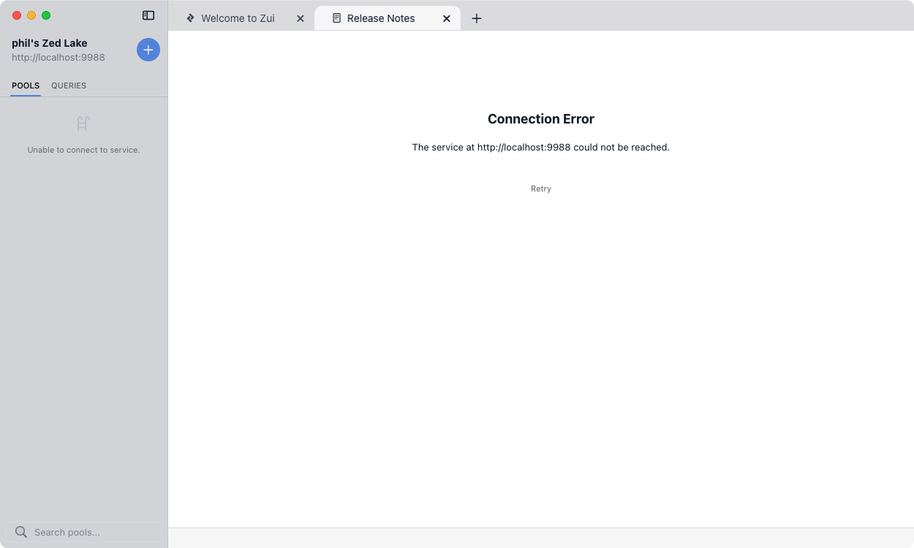

# Zed Lake Migration

As the [Zed](https://zed.brimdata.io/) system is young and evolving, there's
the potential that new functionality may require changes to the
[lake storage format](https://zed.brimdata.io/docs/next/lake/format) that are
not backward compatible. While we expect these changes to be rare, such a
change recently occurred such that Zed lakes created with
[Zed v1.5.0](https://github.com/brimdata/zed/releases/tag/v1.5.0) and older
("v1 format") will not be readable by [Zed v1.6.0](https://github.com/brimdata/zed/releases/tag/v1.6.0)
and newer ("v3 format"). This change will also affect tools that use Zed lakes
such as the [Zui](https://zui.brimdata.io/) app (formerly known as Brim).

To help users make the transition, the tools in this repository can be used to
migrate lakes to the newer format.

## Limitations

To keep the migration tools simple, there are some limitations.

1. Only the `main` [branch](https://zed.brimdata.io/docs/commands/zed#22-branch)
of each pool is migrated.

2. The contents of the migrated pool are loaded in "v3 format"as a single
[commit](https://zed.brimdata.io/docs/commands/zed#141-commit-objects). The
"v1 format" commit history is therefore not preserved, so
[time travel](https://zed.brimdata.io/docs/commands/zed#15-time-travel)
will not be possible to pre-migration commits.

3. If you have a very large number of pools to migrate, the script may fail
with a `too many open files` error. This can be addressed by increasing the
system's hard limit on the number of file descriptors. Many references are
available that advise how this may be done, such as
[this article](https://docs.oracle.com/cd/E93962_01/bigData.Doc/install_onPrem/src/tins_postinstall_file_descriptors.html).

We expect most users are not yet dependent on the features affected by these
limitations. However, if your environment is severely impacted by these
limitations, come talk to us on the
[Brim community Slack](https://www.brimdata.io/join-slack/).

## Usage

Download and unpack the newest migration kit
[release](https://github.com/brimdata/zed-lake-migration/releases)
for your operating system. The migration script in the kit is preconfigured
to work out-of-the-box to migrate the Zed lakes from a
[Brim v0.31.0](https://github.com/brimdata/brim/releases/tag/v0.31.0)
install to a [Zui v1.0.0](https://github.com/brimdata/zui/releases/tag/v1.0.0)
install. If this is your use case, simply run the script as shown below. In
this example, two pools are migrated on a macOS system.

```
$ sh migrate.sh 
migrating lake at '/Users/phil/Library/Application Support/Brim/lake' to '/Users/phil/Library/Application Support/Zui/lake'
migrating pool 'wrccdc.pcap' (2MCssyxdqCxwx2pvIabmQoNF21R)
migrating pool 'example_pool' (2MCsuDhqnoE2QB6p4reHWJdaI9z)
```

The migrated pools will be shown the next time you open Zui. If your Zui app is
already open, click **View > Reload** from the pull-down menu to see the
list of migrated pools. Because Zui's [user data](https://zui.brimdata.io/docs/support/Filesystem-Paths#user-data)
directory is separate from Brim's, the "v1 format"  storage left in the Brim
app's user data path will no longer be accessed and can be backed up and/or
deleted.

See the sections below if you're migrating between [Zui Insiders](#zui-insiders)
releases or if you're managing your lake directly with the
[Zed CLI tools](#zed-cli-tools).

> **Note:** On Windows the migration script must be run in `sh` variants like
> [BusyBox](https://busybox.net/), [Cygwin](https://www.cygwin.com/), or
> [MSYS2](https://www.msys2.org/). If you do not have any of these already set
> up, we recommend downloading
> [busybox.exe](https://frippery.org/files/busybox/busybox.exe)
> as it seems to be the easiest. Once downloaded, start the shell. See the
> [Busy Box documentation](https://frippery.org/busybox/) for more detail.
>
> ```
> C:\path\to\busybox.exe sh -l
> ```
> 
> This will drop you into a `sh` environment where you can execute the
> migration script as shown previously.

## How It Works

For ease of use, the migration kit includes a
[Zed v1.5.0](https://github.com/brimdata/zed/releases/tag/v1.5.0) binary
that can read the "v1 format". The migration script uses this binary to perform
a bulk dump of the older lake's contents to a single, temporary
[ZNG](https://zed.brimdata.io/docs/formats/zng) file via
[`zed query`](https://zed.brimdata.io/docs/commands/zed#211-query).
A new `zed` binary (such as the one bundled with the Zui app) is then used to
[`zed load`](https://zed.brimdata.io/docs/commands/zed#28-load) the ZNG into
a new "v3 format" lake (such as the one behind Zui). Finally, a ZNG dump is
performed of the newly-loaded lake and the two ZNG dumps are compared to
confirm they are byte-for-byte equivalent. If the lakes are confirmed to be
equivalent, the temporary dump ZNG files are removed. The script will provide
error output if migration fails or the ZNG dump comparison finds any
differences.

## Zui Insiders

[Zui Insiders v0.30.1-196](https://github.com/brimdata/zui-insiders/releases/tag/v0.30.1-196)
was the last release with "v1 format" lake storage. Therefore when
Zui Insiders is updated to a newer release, the Zed service will attempt and
fail to read the lake in the older format and not successfully start, resulting
in a failure like the one shown below.



To migrate the lake with Zui Insiders, a special migration kit release
[v0.0.1-for-zui-insiders](https://github.com/brimdata/zed-lake-migration/releases/tag/v0.0.1-for-zui-insiders)
has been created with specific [filesystem paths](https://zui.brimdata.io/docs/support/Filesystem-Paths)
for Zui Insiders. After downloading and unpacking the Zui Insiders migration
kit for your OS, follow the steps below.

1. Quit the Zui Insiders app.

2. Rename the lake directory by appending `-v1` to the end of its name. The
table below shows the final directory name for each OS.

   |**OS Platform**|**Location**                                                |
   |---------------|------------------------------------------------------------|
   | **Windows**   | `%APPDATA%\Zui - Insiders\lake-v1`                         |
   | **macOS**     | `$HOME/Library/Application Support/Zui - Insiders/lake-v1` |
   | **Linux**     | `$HOME/.config/Zui -Insiders/lake-v1`                      |

3. Run the `migrate.sh` script as shown in the [Usage](#usage) section above.

Once migration is complete, the `-v1` directory will no longer be accessed and
can be backed up and/or deleted.

## Zed CLI Tools

By default the kit migrates between well-known
[filesystem paths](https://zui.brimdata.io/docs/support/Filesystem-Paths)
used for lake storage by the Brim, Zui, and Zui Insiders apps. However the
migration script also accepts parameters for the source/destination lake
directories that can be used instead of the default paths. In addition
to providing these parameters, you'll need to ensure that current [`zed`](https://zed.brimdata.io/docs/commands/zed) and
[`zq`](https://zed.brimdata.io/docs/commands/zq) binaries (e.g., `v1.6` or newer)
are in your `$PATH` so the script can create your new lake in "v3 format".

The following example run shows two pools in a "v1 format" lake being
successfully migrated to a "v3 format" lake.

```
$ sh migrate.sh $HOME/oldlake $HOME/newlake
migrating lake at '/Users/phil/oldlake' to '/Users/phil/newlake'
lake created: /Users/phil/newlake
migrating pool 'pool_one' (2MI4fF2M7c1a6MzgaY7j1C0dN1I)
migrating pool 'pool_two' (2MI4fXsl2tCfYAzaaLrA4MrxgfM)
```

## Having a problem?

If you have problems with data migration feel free to
[open an issue](https://github.com/brimdata/zed-lake-migration/issues/new) or
come talk to us on the
[Brim community Slack](https://www.brimdata.io/join-slack/).
